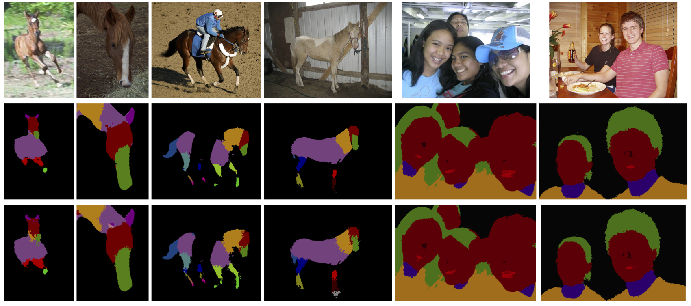

# Complex Relations in a Deep Structured Prediction Model for Fine Image Segmentation

This repository contains Keras/Tensorflow code for the "CRF-RNN" semantic image segmentation method, published in the ICCV 2015 paper [Conditional Random Fields as Recurrent Neural Networks](http://www.robots.ox.ac.uk/~szheng/papers/CRFasRNN.pdf). This paper was initially described in an [arXiv tech report](http://arxiv.org/abs/1502.03240). The [online demo](http://crfasrnn.torr.vision) of this project won the Best Demo Prize at ICCV 2015. Original Caffe-based code of this project can be found [here](https://github.com/torrvision/crfasrnn). Results produced with this Keras/Tensorflow code are almost identical to that with the Caffe-based version.

If you use this code/model for your research, please cite the following paper:

Train:
$ python train_gby.py -m fcn_RESNET50_8s -ds streets -e 1 -bs 32 -vb 1 -is 224

Eval/Test:
$ python eval_gby.py -ds horsecoarse -w /storage/gby/semseg/horsecoarse_weights_fcn_RESNET50_8s_100ep

